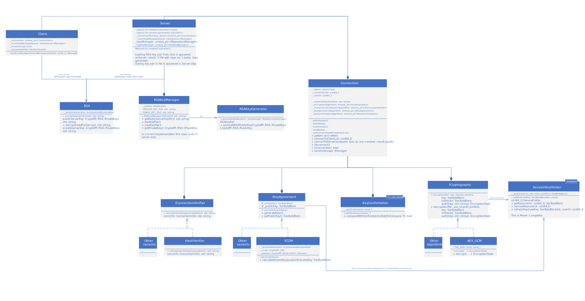

# Cryptography system
### Authentication

The main idea of the architecture is the ability to configure the connection at the stage of its creation.

All subsequent statements work for the following cryptography configuration:
- Encryption: AES GCM
- Key exchange protocol: ECDH
- Checking the correctness of the shared key: sending a message with a known content ([NIST SP 800-152](https://csrc.nist.rip/external/nvlpubs.nist.gov/nistpubs/SpecialPublications/NIST.SP.800-152.pdf), paragraph 6.6.3) 
- Connection verification: The idea is taken from [Towards Securing Client-Server Connections against.pdf](https://www.mihaiordean.com/articles/JEq8FDkHdZX6.pdf) (the same [file](./Towards%20Securing%20Client-Server%20Connections%20against.pdf)).

Also, this architecture will work for any symmetric encryption algorithm if the hash of generated shared key is used as the content encryption key (or, with with minor modifications, key encryption key).

The diagram below shows how the parts of the cryptographic system interact with each other and with the server.

The dependencies shown in the diagram make it possible to configure the security elements separately: the encryption method, the key creation protocol, the key confirmation protocol, the connection verification algorithm - which allows you to configure the connection in a variety of ways.

### Connection

The diagram below shows how the application sides will be connected.

Connection stages:
1. Setting up an anonymous connection.
2. Connection verification (included in password authentication). If it fails, the server cannot be sure that it is working with a real client.
3. If the client has confirmed that he is the one the server knows, a shared key is generated (used for symmetric encryption).
4. As a result of generation, both the client and the server have a key, but they cannot be sure that the other side has exactly the same one. To do this, the client sends an encrypted message with known content. If the server decrypted and received the correct values, it is assumed that both parties received the same key.

### Some details of current implementation

- Default key sizes at 128 security bits ( [info](https://www.keylength.com/en/4/) ):
  - AES - 128 bits (column "Symmetric Key")
  - ECDH - 256 bits (column "Elliptic Curve")
  - RSA - 3072 bits (column "Factoring Modulus")

**WARNING** If you want to change key length, choose such sizes according to link above, because if you do not comply with it, you get a system in which there is a weaker unit.

To reduce the size from ECDH 256 bits to AES 128 bits, used optional function ECDH::cutInHalf.

- There are two types of keys:
  1. Key Encryption Key (KEK);
  2. Content Encryption Key (CEK).

In our cryptography system the CEK is hash of ECDH result and contains in SessionKeyHolder. (for more information, read 1st paragraph of [ECDH](https://ru.wikipedia.org/wiki/Протокол_Диффи_—_Хеллмана_на_эллиптических_кривых) and [Key derivation function](https://ru.wikipedia.org/wiki/Функция_формирования_ключа)).
- Key pair implies public and private RSA key
