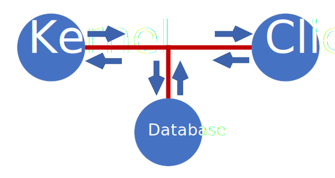

# Kernel integration testing

### Introduction:
The basic idea of testing is to test the functionality of the object under test.

There are a sufficient number of types of testing, such as unit tests, integration tests, functional tests, and so on.

### The main rule when writing tests:

*Write tests for functionality, not write functionality for tests. Don't forget this.*

### The example we're looking at is integration testing of a kernel. 

Integration testing is a type of testing where software modules are combined logically and tested as a group. In our case the group is: kernel, client, database.

As shown in the graph the modules are interconnected. In fact: we have to test their interconnection.

It is too resource consuming to use "full" objects, that's why mocs come to the rescue.

### Mock object:

Mock is "parody" , "imitation". 
Creating a mock-object is a simplified analog of the object under test. The object has the necessary functionality to be tested, as well as being a simplified version of itself.

By creating mock objects, you reduce the complexity of the object itself and also simplify testing. 

### Preparing for testing: 
- First, you need to connect to the mock database. The [TestUtility.hpp file](https://github.com/f1nal3/Juniorgram/blob/dev/Kernel/Kernel.Test/Utilities/TestUtility.hpp) has a getTestDatabase() method to initialize the database and work with it further. 
- Connect the test client to the ip address of your kernel in the [TestKernelInfo.hpp](https://github.com/f1nal3/Juniorgram/blob/dev/Client/Client.TestObject/TestKernelInfo.hpp) file. 
- Make sure that your client connects to the kernel.

### Testing:
Testing takes place as follows: 

Test Order:
- The client sends a message to the kernel.
- The kernel processes the message coming from the client side.
- The kernel sends the message to the database to check the data for correctness and subsequent data storage.
- The kernel generates a response to the client.
- The client receives and gives its response to the message. 

The task of the tests is to check the correctness of the routing of data packets from the client to the kernel side, 
as well as their further processing in the mock database. 
