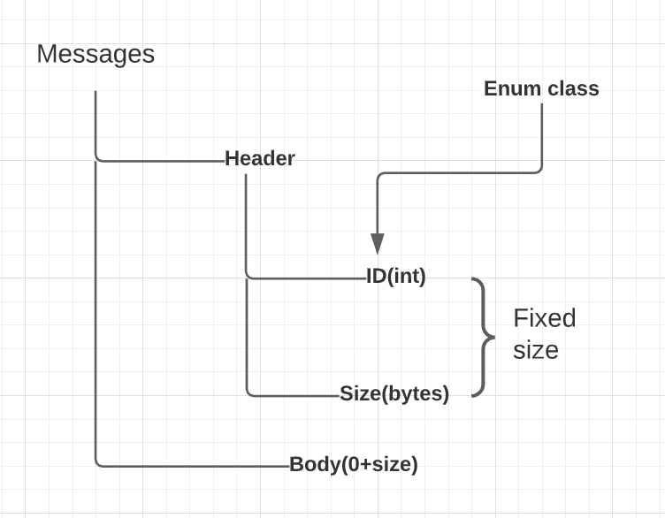

# Description of several classes:

# Connection

### Attributes:

<hr>

```c++
OwnerType mOwner = OwnerType::SERVER 
```
the "owner" decides how some of the connection behaves.

<hr>

```c++
 uint64_t mID = uint64_t()
```
connection ID.

<hr>

```
 asio::ip::tcp::socket mSocket 
 ```
Each connection has a unique socket to a remote.

<hr>

 asio::io_context& mContextLink - this context is shared with the whole asio instance.

<hr>

 SafeQueue<Message>& mIncomingMessagesQueueLink - this references the incoming queue of the parent object.

<hr>

SafeQueue<Message> mOutcomingMessagesQueue - this queue holds all messages to be sent to the remote side of this connection.

<hr>

Message mMessageBuffer - incoming messages are constructed asynchronously, so we will store the part assembled message here, until it is ready


## Methods:
<hr>

```c++
void writeHeader() 
```
this func. suggests that we have messages we want to send. And we use the function asio::async_write(mSocket, asio::buffer(&mOutcomingMessagesQueue.front().mHeader, sizeof(Message::MessageHeader)) to write the header of the message to the socket.

if the writing header to the socket failed, we display an error message - "[<clientID> ] Write Header Fail."
Otherwise, we try to write the body of the message if it is not empty. If it is empty, then we remove the current message from the message queue to send and take the following header from queue and then write the body.

<hr>

```c++
void writeBody() 
```
if the writing body to the socket failed, we display an error message - "[<clientID> ] Write Body Fail."
Otherwise, we remove the message from queue using mOutcomingMessagesQueue.pop_front(), and if queue isn't empty - try to write the header of the message.

<hr>

```c++
void readHeader() 
```
using this func we are getting header from socket. If it possible - further we resize the messages body vector and call ReadBody().
Otherwise, we have header.size <= 0 and add the bodyless message to the connections incoming message queue.
if reading body from socket failed, we display an error message - "[<clientID> ] Read Header Fail."

<hr>

```c++
void readBody()
``` 
If this function is called, a header has been read, and that header request we read a body, The space for that body has already been allocated in the temporary message object, so just wait for the bytes to arrive. Next we call AddToIncomingMessageQueue() for adding message in queue.
If we can't read the body from the socket we display an error message - "[<clientID> ] Read Body Fail."

<hr>

```c++
void addToIncomingMessageQueue() 
```
once a full message is received, add it to the incoming queue. Shove it in queue, converting it to an "owned message", by initializing with the a shared pointer from this connection object for Server side and without shared pointer from this for Client side. Next we call ReadHeader() to read other messages.

<hr>

```c++
Connection(const OwnerType& owner, asio::io_context& contextLink, asio::ip::tcp::socket socket, SafeQueue<Message>& incomingMessagesQueueLink)
```
specify owner, connect to context, transfer the socket provide reference to incoming message queue.

<hr>

```c++
const uint64_t& getID() const 
```
this ID is used system wide - its how clients will understand other clients whole system.

<hr>

```c++
void connectToClient(const uint64_t& uid = uint64_t()) 
```
this func allows only Server side connect to other Clients.

<hr>

```c++
void connectToServer(const asio::ip::tcp::resolver::results_type& endpoint) 
```
only clients can connect to servers. And make a request asio attempts to connect to an endpoint.

<hr>

```c++
void disconnect() 
```
check if we have connection with smb/smth. If we have connection we call asio::post, because the current context is holding locks and you want the function to be called after they have been released. This would allow the function to acquire those locks itself without causing a deadlock.

<hr>

```c++
const bool isConnected() const 
```
check if current socket is open.

<hr>

```c++
void send(const Message& message) 
```
send a message, connections are one-to-one so no need to specifiy the target, for a Client, the target is the Server and vice versa.

If the queue has a message in it, then we must assume that it is in the process of asynchronously being written. Either way add the message to the queue to be output. If no messages were available to be written, then start the process of writing the message at the front of the queue.

# Message

## Attributes:

std::shared_ptr<Connection> mRemote = nullptr - on a server, the owner would be the client that sent the message, on a client the owner would be the server.

MessageHeader mHeader - header of the message.

std::vector<uint8_t> mBody - contain a raw bytes information.
<hr>

## Methods:

size_t size() const - returns size of entire message packet in bytes.

<hr>

```c++
friend std::ostream& operator <<(std::ostream& os, const Message& message) 
```
override for std::cout compatibility - produces friendly description of message

<hr>

```c++
template<typename T>
friend Message& operator <<(Message& message, const T& data) 
```
pushes any POD-like data into the message buffer.

Check that the type of the data being pushed is trivially copyable. Check that the type of the data being pushed is trivially copyable. Resize the vector by the size of the data being pushed. Physically copy the data into the newly allocated vector space. Recalculate the message size. Recalculate the message size.

<hr>

```c++
template<typename T>
friend Message& operator >>(Message& message, T& data) 
```
pulls any POD-like data form the message buffer.

Check that the type of the data being pushed is trivially copyable. Cache the location towards the end of the vector where the pulled data starts. Physically copy the data from the vector into the user variable. Shrink the vector to remove read bytes, and reset end position. Recalculate the message size. Return the target message so it can be "chained".

Message::MessageHeader

# Message Header is sent at start of all messages.

## Attributes

MessageType mID = MessageType() - message ID

uint32_t mBodySize = uint32_t() - current size of message part.

## MessageType

ServerAccept - server has accepted a connection.

ServerPing - the time response from server.

MessageAll - to send a message to all clients.

ServerMessage - (plug) some message for server.


# Diagrams

.png)  
  
.png)  
