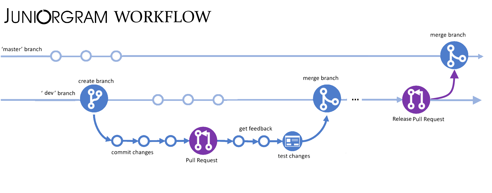

# The work on the project is structured as follows:
1. There is a pool of tasks, they are gradually replenished.
2. During meetings, these tasks are distributed among the performers.
3. While performing the task, you need to create a draft pull request, where you need to put your works, so that team can check in which direction the development is moving.
4. When the developer decides that the work is finished, he withdraws the pull request from the draft state.
5. The code is checked by the whole team, and if there are any errors, they are corrected
6. After permission is given the code is merged into the dev branch.
7. Performer ask for a new task.

For more details you could [look here](./Contributing%20code.md)

# Global delivery
The development of the application is broken down into some intermediate steps. Each stage is described in a specific mailstone. When all the tasks nested in the current cycle have been completed, a procedure for capturing the changes is initiated. This procedure is called a release. 
It commits to the main branch and starts the CI/CD procedure which sends the updated binaries to the server.